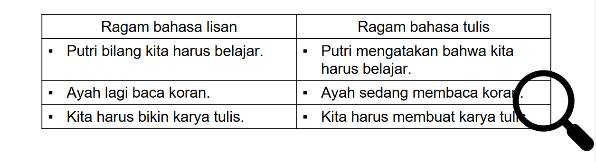

# PERT 1

## Pendahuluan

Indonesia memiliki berbagai bahasa seperti Jawa, Madura, Sunda, Melayu, dsb. Bahasa tersebut adalah bahasa yang umumnya digunakan oleh bangsa Indonesia.

Hingga pada tanggal 28 Oktober 1928, para pemuda beriklar Sumpah Pemuda, yang secara resmi mendeklarasikan **Bahasa Indonesia**

Faktor Pendukung Bahasa Indonesia menjadi bahasa nasional :

1. Faktor sejarah
   Bahasa Melayu adalah *lingua franca* atau bahasa penghubung di Indonesia
1. Kesederhanaannya
   Faktor linguistik seperti fonologi, morphologi, sintaksis yang mudah dipelajari
1. Psikologis 
   Rasa nasionalisme mendorong Bangsa Indonesia untuk mengadopsi Bahasa Indonesia (Sumpah Pemuda)
1. Reseptif
   Bahasa Melayu (Indonesia) bersifat terbuka/reseptif dimana dapat menerima serapan dan mampu beradaptasi dengan lingkungan sekitar yang menuturkan bahasa selain Bahasa Melayu

## Kedudukan dan Fungsi Bahasa Indonesia

Secara nasional dan hukum kedudukan Bahasa indonesia ada pada Iklar Sumpah Pemuda dan UUD 1945 Pasal 36

### Bahasa Nasional

Kedudukan Bahasa Indonesia sebagai Bahasa Nasional adalah

* Lambang Kebangaan dan identitas nasional
* Alat pemersatu bangsa

### Bahasa Negara

Berdasarkan Seminar Politik Bahasa Indonesia pada 25 Februari 1975, kedudukan Bahasa Indonesia sebagai bahasa negara adalah :

* Bahasa resmi kenegaraan
  Sejak proklamasi, Bahasa Indonesia digunakan untuk kegiatan bernegara. Oleh karena itu Bahasa Indonesia wajib digunakan sebagai bahasa resmi kenegaraan.
* Bahasa pengantar resmi di Lembaga Pendidikan
  Dalam semua lembaga pendidikan, dari PG hingga Perguruan Tinggi, Bahasa Indonesia adalah bahasa pengantar resmi. Meskipun tidak semua lembaga pendidikan formal menggunakan Bahasa Indonesia sebagai bahasa pengantar, mereka tetap diwajibkan untuk mengajarkan Bahasa Indonesia
* Bahasa penghubung resmi di tingkat nasional
  Televisi, koran, radio dan media media lain, baik dari pemerintahan maupun swasta, menggunakan Bahasa Indonesia untuk menyiarkan dan menyebarkan informasi secara nasional
* Bahasa resmi dalam kebudayaan dan IPTEK
  Karena keberagamaan dalam kebudayaan, dan kemajuan IPTEK yang ada, Bahasa Indonesia cocok untuk menjadi bahasa untuk pengembangan dan pengajaran kebudayaan dan IPTEK di Indonesia.

## Fungsi Bahasa Indonesia

Fungsi Bahasa Indonesia terdiri atas fungsi umum dan khusus (Keraf 2004:3-7)
Fungsi Umum :

1. Media mengungkapkan perasaan dan ekspresi diri
1. Alat komunikasi secara verbal maupun tertulis
1. Alat untuk berinteraksi dan beradaptasi secara sosial
1. Alat kontrol masyarakat (pendidikan, ceramah, instruksi, dsb)
   Fungsi Khusus:
1. Memfasilitasi hubungan sehari hari melalui komunikasi verbal dan nonverbal
1. Mewujudkan kesenian dalam bentuk kesastraan
1. Mempelajari sejarah dan IPTEK
   \>\[!note\]
   \>Fungsi umum adalah fungsi yang setiap bahasa dapat memenuhinya
   \>Fungsi khusus adalah fungsi yang di Indonesia. Bahasa Indonesia mampu memenuhinya

## Hakikat Ragam Bahasa Indonesia

Ragam bahasa adalah variasi akibat lingkungan, situasi, pengunaan dan sebagainya yang berbeda beda

Ragam bahasa diakibatkan oleh keragaman sosial penutur dan fungsi bahasa (Chaer & Agustina 2004)

## Ragam Bahasa Indonesia

### Ragam Lisan

Ragam lisan berasal dalam bagaimana suatu ucapan terbentuk dalam organ tubuh kita

Ciri-ciri ragam lisan dalam bahasa Indonesia adalah :

1. Langsung (tanpa menggunakan media)
1. Tidak terikat ejaan
1. Tidak selalu efektif
1. Kalimatnya pendek-pendek karena dianggap lawan bicara telah mengerti apa yang disampaikan
1. Bergantung pada konteks dan situasi

### Ragam Tulisan

Ragam tulis berasal dari bagaimana suatu bahasa ditulis dengan huruf. 
Ragam tulis memiliki kelengkapan unsur tata bahasa, dan struktur kalimat

Ciri ragam tulis adalah :

1. Santun
1. Efektif
1. Komunikasi sepihak
1. Menggunakan pedoman ejaan (PUEBI)
1. Kosa kata baku

|Ragam Lisan|Ragam Tulisan|
|-----------|-------------|
|Langsung|Lisan|
|Tidak terikat aturan|Mengikuti PUEBI|
|Tidak efektif|Efektif|
|Disingkat-singkat|Lengkap|
|2 arah|Sepihak|
|Situasional dan kontekstual|Datar dan netral|

Ragam bahasa resmi digunakan pada situasi resmi (surat menyurat, komunikasi formal)
Ciri cirinya adalah :

1. Digunakan pada situasi resmi
1. Nasa bicara datar
1. Menggunakan kalimat lengkap

Ragam bahasa tidak resmi digunakan pada situasi sehari-hari
Ciri-cirinya adalah :

1. Digunakan pada situasi tidak resmi
1. Menggunakan kalimat yang tidak lengkap (Otansa, 2010)

### Ragam bahasa sesuai bidang pemakaian

Berdasarkan pokok persoalan yang ada ragam bahasa yang ada dapat berupa pengunaan kalimat yang berbeda, berdasarkan pokok persoalan yang ada

### Ragam bahasa berdasarkan daerah penutur

Dialek adalah ragam bahasa yang berasal dari suatu tempat. 
Dialek sifatnya adalah saling mengerti, yaitu dimana setiap pentur memahami bahasa yang ada di lingkungan. Contohnya adalah di daerah Jawa, bahasa Indonesia akan dicampur dengan bahasa Jawa agar penyampaian dan komunikasi menjadi lebih mudah dan efektif
