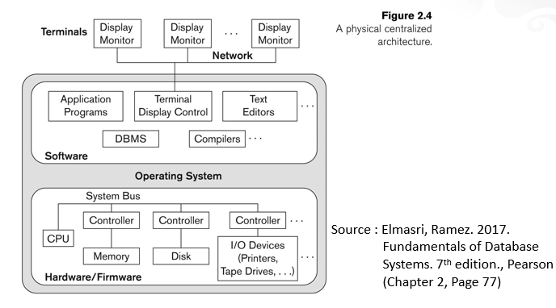

# Arsitektur dan Konsep Sistem Database

## Data dan Informasi

Data adalah fakta mentah yang didapat dari suatu proses information gathering atau input. Informasi adalah data olahan yang digunakan untuk mendapat makna. Data perlu diolah dan diproses sebelum menjadi informasi. 
Contoh pengolahan data adalah sebagai berikut :

* Konversi teks ke angka
* Konversi tabel CSS ke DATE format di SQL
* Pengekstrakan teks dari suatu data menggunakan regular expression
* Pengolahan data menggunakan LLM untuk mendapatkan intisari dari data tersebut

## Database System

Basis data menyimpan hal hal berikut :

* Data yang telah diproses
* Metadata (Karakteristik data)

DBMS adalah aplikasi yang mengontrol manajemen terhadap struktur, dan akses terhadap basis data tersebut. DBMS digunakan untuk menyimpan informasi penting dalam aplikasi/perusahaan. DBMS memerlukan hal-hal berikut agar dapat bekerja dengan baik

* Data yang terkait
* Program untuk mengakses data
* Lingkungan yang mendukung

DBMS mengelola data yang berharga, kompleks dan diakses oleh berbagai pengguna/aplikasi secara bersamaan.

### Desain DBMS

DBMS dapat memiliki struktur seperti 2 tier dan 3 tier. DBMS 2 tier adalah DBMS yang memperbolehkan akses kueri langsung kepada DBMS tersebut. Sedangkan DBMS 3 tier memerlukan aplikasi untuk sebagai perantara kueri terhadap DBMS

### Komponen DBMS

* Hardware
* Software (Software DBMS)
* Data (Schema)
* Prosedur (instruksi/aturan yang berlaku pada DBMS)
* People 
  * Administrator
  * Designer
  * System Analyst
  * Programmer
  * End User

### Kegunaan DBMS

* Mencegah Redundansi data atau data yang berlebih
* Mempermudah akses data
* Isolasi data berdasarkan asal, format, dan tipe
* Menjaga integritas data 
* Perubahan Data secara atomis (1 step)
* Dukungan untuk akses bersamaan untuk banyak pengguna
* Menjaga keamanan data

### Data Model

Untuk menjelaskan semantik, hubungan dan batasan terhadap data

Bentuk data relasional dapat dalam bentuk :

* Entity Relationship (PRIMARY KEY, FOREIGN KEY, dsb dalam SQL, MySQL dsb)
* OOP (PostgreSQL)
* Semi Structured (XML/JSON)
* Hierachical Network Model

### Three Schema Architecture

<dl>
	<dt> Internal Schema </dt>
	<dd> Adalah Skema yang menggambarkan implementasi DBMS secara low level, seperti dalam bentuk manajemen file DB, manajemen penyimpanan, dsb  </dd>
	<dt>Conceptual Schema</dt>
	<dd>Penggambaran akan data dan hubungannya dalam suatu DB secara high level, digunakan untuk memahami struktur dan hubungan entitas DB</dd>
	<dt>External Schema</dt>
	<dd>Adalah gambaran DB sebagai suatu tabel-tabel berhubungan yang dapat diakses dengan kueri DB, umumnya aplikasi menggunakan External Schema</dd>
</dl>
### Data Independence
Yaitu kemampuan untuk merubah skema yang lower level tanpa memengaruhi skema higher level karena hanya pemetaannya yang berubah
+ Logical Data Independence
	 Kemampuan untuk merubah skema konseptual tanpa merubah skema eksternal. Contoh : merubah isi record, maupun merubah format/tipedatanya
+  Physical Data Independence
		Kemampuan untuk merubah skema internal tanpa merubah skema konseptualnya. Contoh : menambah index, merubah penyimpanan

### Arsitektur DBMS

DBMS Terpusat
Yaitu DBMS yang tergabung dalam 1 sistem, sehingga walau dapat diakses secara remote, tetap diproses pada DBMS yang sama

DBMS Two Tier
Yaitu DBMS yang menggunakan sistem client server, umumnya dalam bentuk DBMS maupun web server. Pengaksesannya dilakukan dengan menggunakan JDBC, ODBC dsb menggunakan suatu program/skrip

DBMS Three Tier
Yaitu DBMS yang menggunakan sistem client server aplikasi, yang umum digunakan ketika end user bukan merupakan yang berkepentingan dalam database.

