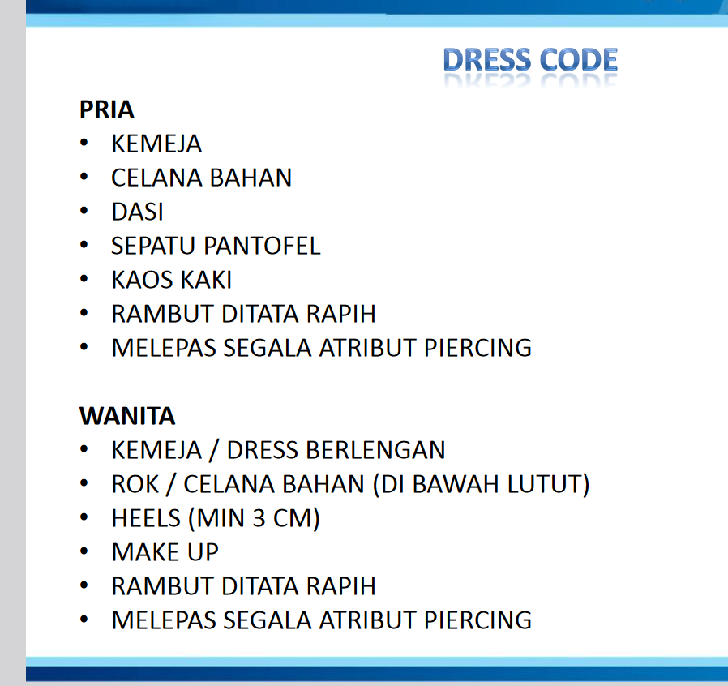

## DRESS CODE

## Definisi

Etiket adalah suatu label / tanda pengenal terhadap individu atas hal yang disetujui bersama

 > 
 > “ A knowledge of etiquette helps us to do and say the right thing at the right time. It makes no difference how wealthy or how poor a person is , as a human being, he or she is entitled to sympathy and respect “

## Fungsi dan mamfaat

* Memupuk persahabatan
* Menyenangkan orang lain, dan tidak menyinggung orang lain
* Menjaga hubungan baik

## Peranan

Etiket menunjukkan *personal image* terhadap seseorang secara profesional.

 > 
 > \[!tip\]
 > First Impression sangat penting karena lebih kuat dari kata kata

Contohnya adalah :

1. Menggunakan busana yang sopan
1. Usahakan tidak pernah terlambat, dan beritahulah jika terpaksa
1. Memberikan kartu nama dengan dua tangan dan jangan terbalik
1. Menggunakan email nama asli
1. Memberitahukan jumlah orang yang akan makan, dan tidak serakah saat makan

## Peranan Comunication Skill dalam kehidupan

Manusia memiliki banyak peran, dalam pekerjaan kita dituntut untuk profesional, dalam rumah kita dituntut menjadi seorang anak yang baik, dan dalam masyarakat kita dituntut untuk menjadi warga yang baik

Hal ini penting karena akan menjadi faktor kesuksesan dalam kehidupan

## ETIKET UBM CARE

1. COMMITMENT (Terus mengembangkan hubungan sosial dan usaha yang terbaik)
1. ACCOUNTABILITY (Bertanggung jawab dan mengembannya dengan baik)
1. RESPECT (Menghargai orang lain dimanapun)
1. EXCELLENT (Menghasilkan karya terbaik)
