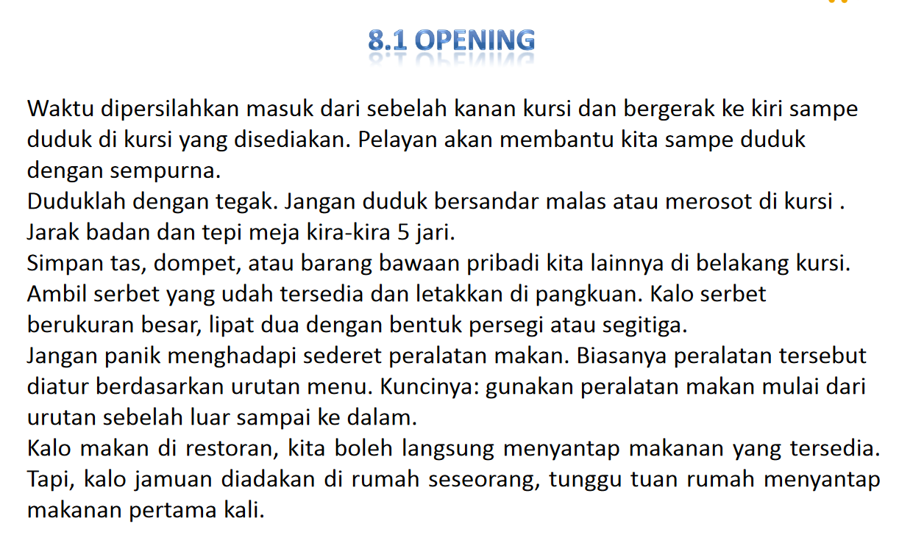
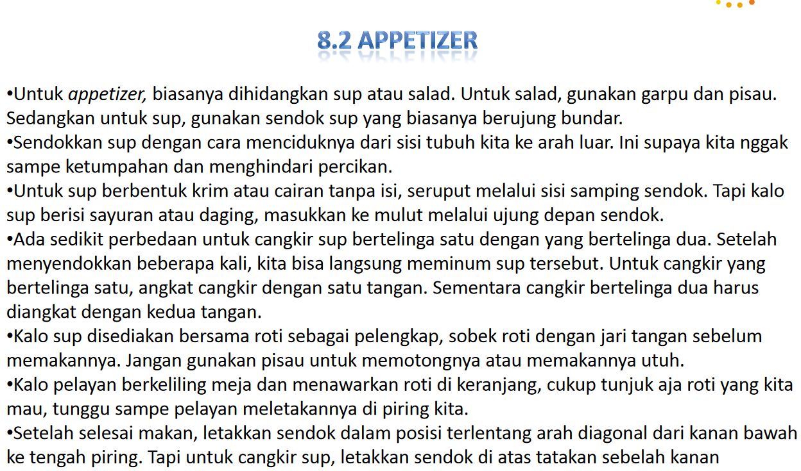
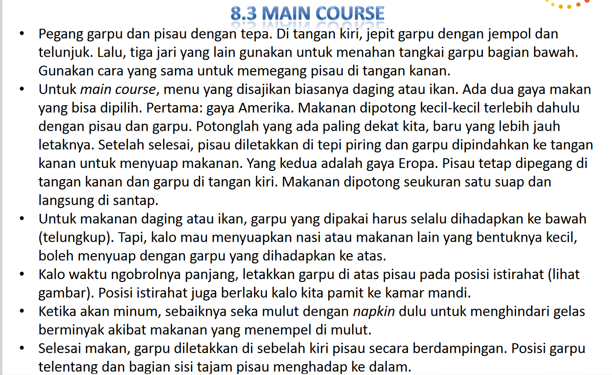
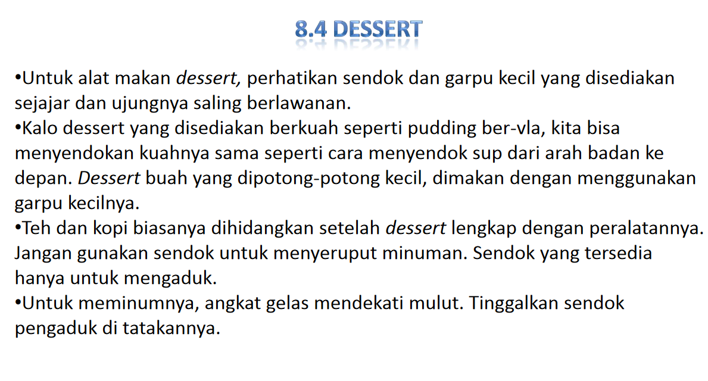

## Etika dan Etiket

### Pengertian

Etika adalah MORAL, nilai-nilai dan norma norma sebagai kontrol perilaku

Etiket adalah SOPAN SANTUN, yang disetujui oleh suatu kelompok masyarakat sebagai panutan bergaul dengan masyarakat

### Persamaan

Sama sama menyangkut perilaku dan mengaturnya secara normatif

### Perbedaan

|Etika|Etiket|
|-----|------|
|Benar salah|Aturan Kesopanan|
|Suatu Prinsip|Perilaku|
|Berbeda tiap individu|Berbeda tiap kelompok maysarakat|
|Bersifat personal|Bersifat sosial|
|Selalu berlaku|Terbatas di masyarakat|
|Absolut|Relatif|
|Secara rohani|Secara lahiriah|

### Etika sebagai Standar Perilaku Sosial

 > 
 > “Apa yang secara moral dianggap benar atau salah dalam perilaku sosial, biasanya ditentukan oleh standar profesi, organisasi, dan individu” 
 > <cite>Russel</cite>

Etiket menilai seseorang **beradab** atau tidak dalam masyarakat

### Etiket Perilaku Umum

* Lift
  * Dahulukan senior
  * Jangan menyerobot
  * Usahakan menyapa orang lain
  * Jangan mengganggu kenyamanan orang lain

* Koridor
  * Usahakan menyapa
  * Tidak makan/minum
  * Tidak bergerombol / berhenti
* Restoran
  * Tidak berbicara terlalu keras
  * Jangan berdecak
  * Jangan duduk terlalu lama ketika sedang ramai

## Etiket Berkomunikasi

* Contoh
  * Bahasa dan intonasi baik
  * Mengucapkan permisi, tolong, terima kasih dan maaf di saat yang tepat
  * Tidak memotong ucapan orang lain
* Manfaat 
  * Melancarkan komunikasi
  * Memahami komunikasi orang lain
  * Diterima oleh masyarakat
  * Pesan disampaikan dengan baik
  * Memperkuat hubungan dan dihargai
  * Tidak bertindak seenaknya

### Etiket Bersikap di Depan Umum

* Tidak meletakkan HP di meja di tempat umum
* Tidak tertawa/berbicara terlalu keras, dan menatap orang yang tidak dikenal
* Harus selalu menyapa orang lain

### Etiket Berbahasa

Meskipun kita terbiasa berbahasa secara kasual dengan teman teman, tetap harus dibiasakan berbicara sopan agar terbiasa dengan etiket berbicara dengan baik

### Table Manner

%% this is very complex lol, i don't dare simplifying %%

1. Opening
   
1. Appetizer
   
1. Main Course
   
1. Dessert
   
