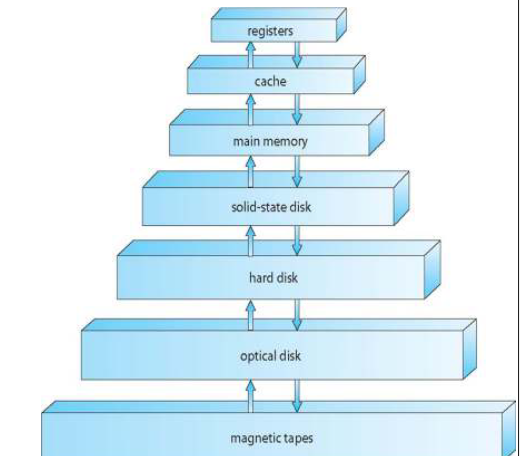

## The OS

Sistem operasi adalah program yang mengelola perangkat keras dan menghubungkannya kepada perangkat lunak lainnya yang dijalankan oleh user.

Struktur OS terdiri atas :

* Hardware
* OS
* User Program
* User (manusia maupun program)

Jenis Jenis OS terdiri atas :

* PC
* Mobile
* Embedded
* Mainframe

Jenis OS adalah :

* Multi-User
  * Mampu untuk digunakan oleh banyak pengguna, secara time sharing maupun sekaligus (mainframe)
* Multi tasking
  * Dapat menjalankan berbagai program sekaligus menggunakan threading maupun multiprocessing (menggunakan banyak core)
* Real Time OS
  * adalah OS khusus yang harus menjalankan instruksi secara sangat cepat, berdasarkan tuntutan program yang harus real time 

## Sejarah OS

### Komputer Generasi Pertama (1945-1955)

Komputer generasi pertama adalah komputer yang bersifat mekanik, menggunakan tabung vakum untuk melakukan komputasi. Komputer ini tidak memiliki OS, hanya menjalankan instruksi secara langsung

### Komputer Generasi Kedua (1955-1965)

Komputer pada masa ini menggunakan sistem batch processing, yang bukan merupakan OS penuh, namun menjadi cikal bakal OS. Pada masa ini komputer telah menggunakan transistor

### Komputer Generasi Ketiga (1965-1980)

Komputer pada masa ini mulai menggunakan sistem operasi, yang mengsupport multi user, dan multi tasking menggunakan teknologi multi threading. Komputer ini telah menggunakan IC

### Komputer Generasi Keempat (1980-Sekarang)

Pada masa PC, OS menjadi sangat penting karena OS mempermudah interaksi antar user dengan komputer

## Organisasi Sistem Komputer

### IO Device

IO device adalah perangkat keras yang memproses input maupun output dari suatu komputer. IO device menggunakan module sebagai perangkat input/output

### Processing Unit

Berupa CPU,GPU, cache dan memory, yang mengkomputasikan data secara biner 

### BUS

BUS adalah bagian komputer yang bertanggung jawab atas transfer data dari hardware satu ke hardware lainnya. BUS dapat bersifat internal seperti PCIE maupun eksternal seperti USB, HDMI, VGA dsb

### Bootstrap

Adalah suatu program yang tersimpan dalam ROM dan bertanggung jawab untuk melakukan proses booting yang merupakan inisialisasi dari hardware dan software yang ada dalam komputer

Bootstrap juga dapat menampung berbagai OS dengan bootloadernya. Ketika OS dipilih, maka kernelnya akan bertanggung jawab untuk memulai proses-proses yang ada dalam OS tersebut

### Interrupt

Yaitu sebuah  sinyal yang diberikan oleh hardware maupun software (syscall) untuk menghentikan operasi yang dijalankan, dan mentransfer program tersebut ke Service Routine. Kemudian CPU akan melanjutkan proses komputasi yang lainnya

Fungsi Interrupt :

* Mentransfer kontrol untuk memanajemen Service Routine
* Interrupt menyimpan lokasi instruksi yang menyebabkannya
* Exception meupakan Interrupt yang terjadi karena error maupun ketentuan program
* OS secara aktif memonitor interrupt 
  Ketika Interrupt terjadi CPU akan mempause kondisi yang ada, dan mengecek jenis Interruptnya, kemudian akan melakukan instruksi yang relevan untuk setiap interrupt (dari tidak ada hingga core dump)

### Struktur IO

IO bekerja secara independen dari CPU sehingga dapat berjalan secara bersamaan. IO menyimpan data pada **local buffer**, dan buffer ini ditransfer ke CPU menggunakan [BUS](PERT%201.md#bus). Logic IO dijalankan dalam **Local Buffer Controller**, dan sinyal [Interrupt](PERT%201.md#interrupt) dijalankan ketika operasi IO selesai dijalankan.

Ketika CPU menunggu IO, maka CPU tersebut akan menunggu sampai IO tersebut selesai. Tidak ada pemrosesan IO secara bersamaan pada 1 CPU

IO dan user program bekerja independen, hanya ketika system call terjadi maka program menunggu IO sampai selesai

### Media Penyimpanan

Penyimpanan disimpan menggunakan Bits yaitu nilai 0/1. Nilai bits disimpan dalam bentuk `byte` yang berupa 8 bits. Dalam komputer 64 bit, 1 `word` yang merupakan besaran ukuran register memiliki 8 `byte`

Penyimpanan disimpan dalam lokasi-lokasi seperti :

* RAM
  * Bersifat Volatile dan Random Access
  * Dapat diakses langsung dengan CPU menggunakan pointer
* Secondary Storage (HDD,SSD)
  * Bersifat non volatil
  * Memerlukan suatu proses agar dapat mengisi data kedalamnya
  * SSD dan NVME lebih cepat dari HDD
    Hireaki Penyimpanan :
    
    Semakin keatas, semakin mahal biaya per byte, namun semakin cepat waktu aksesnya, dan juga sebaliknya

 > 
 > \[!note\]
 > Cache adalah  penyimpanan sementara yang mengakses data dalam suatu buffer agar mempercepat suatu pemrosesan. Cache yang lebih besar akan membuat kinerja komputer semakin baik

### Metode Data Transfer

#### Direct Memory Access

DMA tidak membutuhkan prosesor untuk mentransfer data dari IO ke memori. DMA controller yang bertanggung jawab untuk melepas [BUS](PERT%201.md#bus) ke memori. Proses ini menguntungkan karena CPU tidak perlu fokus untuk memroses IO

Ada 3 mode dalam DMA yaitu :

* Burst Mode, yaitu DMA mengendalikan BUS untuk mengirim data
* Cycle Stealing Mode, yaitu DMA melepas kontrol BUS ke DMA Controller, dan menggunakan clock cycle dari BUS untuk mentransfer byte
* Transparent Mode, yaitu DMA mengambil alih BUS ketika BUS tidak dipakai
  Cara kerja DMA adalah :
* Saat transfer data dengan IO, IO memberikan DRQ ke DMA Controller dan DMA Controller akan meminta CPU untuk HLD
* CPU Melakukan HLD dan akan melakukan HLDA dan melepas fungsi BUS
* DMA melakukan transfer dan memberikan status transfer DACK.
* Setelah proses transfer selesai DMA memberikan interrupt dan CPU mengambil alih BUS dan menjalankan proses lainnya.

#### Programmed IO

Prosesor akan terus mengscan IO apakah sudah siap untuk mentransfer data, namun kekurangannya adalah prosesor tidak dapat merespon proses atau interrupt lainnya

#### Interrupt IO

IO memberikan [Interrupt](PERT%201.md#interrupt) kepada CPU untuk menyimpan State yang akan diproses. Kemudian prosesor akan memproses data transfer tersebut

### Multiprocessing

CPU bertanggung jawab dalam memindahkan data dari layer terbawah ke register, Hal ini cukup merepotkan untuk CPU single core, karena CPU harus sering terpause untuk memindahkan data ke register. 

Mutliprocessing membuat hal ini tidak menjadi  masalah, karena CPU lain dapat mengurusi IO sedangkan CPU utama akan mengurusi aplikasi yang dijalankan

Timesharing adalah metode dimana CPU dapat melakukan pekerjaan lain secara cepat, sehingga komputer menjadi interaktif. 
Beberapa CPU Cores akan menjalankan beberapa task yang diberikan oleh aplikasi. Ketika proses tidak dapat diletakkan dalam memory, maka akan dilakukan swap dan diproses dalam virtual memory.
Hal ini membuat setiap CPU selalu ada hal yang dikerjakan, sehingga ada berbagai proses yang ada dalam memori

## Arsitektur Sistem Komputer

Arsitektur sistem komputer adalah suatu karya yang dihasilkan oleh para pakar komputer sehingga mampu menghasilkan komputer yang serbaguna untuk berbagai keperluan.

Komputer pada umumnya memiliki minimal 1 CPU yang bertanggung jawab terhadap fungsi tertentu. 
Kebanyakan Prosesor jaman sekarang memiliki banyak CPU, yang dinamakan CPU Core

### Arsitektur Von Neumann

* Memiliki CPU, Memory dan IO
* Komputer adalah suatu program yang menjalankan instruksi secara berurutan
* Memiliki BUS

CPU dalam Arsitektur Von Neumann memiliki struktur berikut :

* Input Unit (Register)
* Main Memory (CPU Cache)
* ALU (Menghitung operasi Boolean)
* CU (Memproses Logic)
* Output Unit (Register)

BUS menkoneksikan semua komponen CPU agar data dapat ditransfer dengan sangat cepat

### Clustered System

Sistem ini mirip dengan multicore system, namun perbedaannya adalah CPU Core digantikan dengan 1 komputer penuh. Clustered system memiliki reliability yang lebih tinggi daripada single computer system. 

Clustered system digunakan untuk sistem yang memiliki level paralelisasi yang tinggi seperti HPC, render farm, dsb.  Karena itu, digunakan sistem DLM untuk mencegah konflik operasi. 

## Operasi OS

OS yang secara Interrupt Driven mendapatkan Interrupt dalam bentuk Hardware Interrupt, Exception maupun System Error

OS juga memiliki 2 mode yaitu User Mode dan Kernel Mode. User mode merupakan mode dimana komputer menjalankan instruksi dari User Program. Sedangkan Kernel Mode adalah mode dimana OS akan menjalankan suatu operasi yang bersifat system level, yang tidak dapat diganggu oleh user

OS dapat secara otomatis mendetect infinite loop dan ketika timer mencapai nilai 0, maka interrupt akan diberikan dan OS akan mengambil alih kontrol / mematikan program tersebut

## Kernel

Kernel adalah program utama dalam suatu OS. Kernel menjembatani antara hardware dengan software agar dapat menggunakannya secara bijak dan aman. Kernel menerjemahkan kode biner menjadi sinyal listrik ke hardware

Kernel berfungsi untuk :

* Mengelola sumber daya dalam komputer secara baik
* Melayani request software terhadap pengunaan hardware
* Multiplexing, atau mengatur alokasi waktu terhadap pengunaan hardware
* Layer abstraksi terhadap hardware, yang memudahkan interaksi ke hardware
* Memberikan akses memori yang aman dan menghindari segmentation fault, memory leak, dsb
* Sebagai sebuah shell bagi user dalam Terminal

Jenis jenis kernel ialah :

* Monolithic kernel, yaitu kernel yang memberikan lapisan abstraksi perangat keras secara penuh Contoh :Linux, UNIX
* Microkernel memberikan abstraksi yang terbatas, dan menggunakan server untuk menjalankan fungsionalitas lain Contoh : macOS, AIX, MINIX
* Hybrid kernel adalah gabungan antara monolithic dan mikrokernel, ataupun tipe kernel lainnya Contoh : Windows NT, Android
* Exokernel adalah kernel yang memiliki layer abstraksi secara minimal, sehingga aplikasi dapat mengakses hardware secara langsung (berada pada ring 0 seperti di Commodore / TempleOS) 

Struktur data Kernel :

* Single Linked List `<linux/list.h>`
* Double Linked List `<linux/list.h>`
* Circular Linked List `<linux/list.h>`
* Binary Search Tree `<linux/list.h>`
* Hash Map `<linux/hashtable.h>`
* Bitmap `<linux/bitmap.h>`

Cara Kerja Kernel adalah memanajemen aplikasi, memori dan hardware agar bekerja secara efisien. Kernel dapat berkomunikasi dengan software maupun hardware dengan menggunakan system call

## EXTRAS

### Process Management

Proses adalah program yang sedang diesekusi. Proses memakan penggunaan CPU, IO, file dan memori. Proses harus diterminasi agar dapat kembali menggunakan sumber daya yang ada.

Single thread process menjalankan program secara sekuensial, sedangkan multi threading menjalankannya secara simultan

OS memberikan fasilitas dalam process management seperti 

* Menjalankan, menunda dan menghentikan suatu proses
* Mekanisme sinkronisasi dan komunikasi
* Deadlock handling

## Memory Management

Semua data harus diload dalam memori agar dapat diproses. Memori dapat dimanajemen dengan cara berikut :

* Memantau memori yang dipakai
* Menentukan data yang harus diswap
* Mengalokasi dan dealokasi memori

### Storage Management

* Memberikan interface kepada perangkat perangkat penyimpanan
* Mengelola File System
* Mengelola akses file
* Memanipulasi file dan direktori
* Mapping file dan backup
* Mengelola ruang kosong dalam penyimpanan
* Mengalokasi penyimpanan
* Disc Scheduling

### IO subsystem

Memberikan layer abstraksi terhadap IO. Manajemennya dapat berupa :

* Memory Management (buffering, caching, spooling (piping))
* Driver untuk hardware
